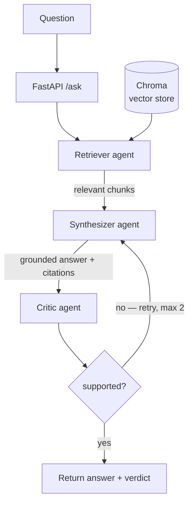

# Investment Research Assistant

A multi-agent RAG system that answers investment-research questions over
financial documents. Three specialized agents retrieve, synthesize, and
fact-check each answer, with a self-correction loop — and the system refuses
to answer rather than fabricate when the documents don't support a confident
response.

**Stack:** Python · LangGraph · Chroma · OpenAI (gpt-4o-mini) · FastAPI · Langfuse

---

## Why it exists

At a wealth-management firm, analysts answer client research questions by
reading earnings reports, news, and internal notes, then writing a grounded
summary by hand — slow and inconsistent. This system does that reading and
synthesis, returns a cited answer, and (critically for finance) says
*"I don't have enough information"* instead of guessing. A confident wrong
number can move real money, so refusing when uncertain is a feature.

---

## Architecture

**Query flow (online):**




Built as a **LangGraph state graph**: the three agents are nodes, and a
conditional edge after the critic loops back to the synthesizer when the
answer isn't supported, capped at two retries. The **generator (synthesizer)
and checker (critic) are separate agents** so the fact-check is independent
of the answer that produced it.

Ingestion flow (offline): `PDF → pypdf loader → chunker → OpenAI embeddings
→ Chroma`. The chunker is swappable (fixed vs recursive) and each strategy
writes to its own collection, so they can be compared without re-embedding.

---

## Results

Evaluated against a hand-verified golden set of 14 Q&A pairs, scored by an
LLM-as-judge on two axes:

| Metric | Score |
|---|---|
| Correctness (matches ground truth) | 71% (10/14) |
| Faithfulness (grounded, not hallucinated) | 100% (14/14) |

**The system fails safe:** it never hallucinates. The four misses are all
honest refusals on figures buried in flattened financial tables — it declines
rather than guessing wrong.

**Chunking experiment:** fixed vs recursive chunking scored *identically*,
with the same four failures. This isolates the bottleneck as **PDF table
extraction**, not chunking — the row structure of financial tables is lost at
extract time, before any splitter runs. The fix is table-aware extraction, not
a different chunker.

Evaluation was done two ways: a custom LLM-as-judge scorer and Langfuse's
managed dataset experiments.

---

## Run it

Prerequisites: Python 3.13, an OpenAI API key.

```bash
# 1. Clone and enter
git clone https://github.com/lkum11/investment-research-assistant.git
cd investment-research-assistant

# 2. Virtual environment
python3 -m venv venv
source venv/bin/activate

# 3. Dependencies
pip install -r requirements.txt

# 4. Configure secrets
cp .env.example .env      # then edit .env and add your OPENAI_API_KEY

# 5. Add a source document
#    Place an earnings-report PDF at data/raw/apple_earnings_2026q3.pdf
#    (or edit the path in ingest.py)

# 6. Ingest (build the vector store)
CHUNK_STRATEGY=fixed python -m ingest

# 7. Run the API
uvicorn src.api:app --reload
#    then open http://127.0.0.1:8000/docs and POST a question to /ask
```

Run the evaluation:

```bash
CHUNK_STRATEGY=fixed python -m eval.run_eval    # run pipeline over golden set
CHUNK_STRATEGY=fixed python -m eval.score       # score correctness + faithfulness
```

Compare chunking strategies by repeating steps 6–7 with
`CHUNK_STRATEGY=recursive`.

---

## Design decisions

- **Multi-agent (retriever / synthesizer / critic)** — the generator and the
  checker need opposing mindsets; separating them makes the fact-check
  independent and the control flow explicit and traceable.
- **LangGraph** — the critic's retry loop is a real branch + loop + retry cap
  with shared state, which a state graph expresses cleanly.
- **Provider-agnostic LLM client** — all model calls go through one wrapper;
  switching providers is a one-file change.
- **Swappable vector store and chunker** — Chroma is the prototype store behind
  a thin interface; moving to an on-prem store (Weaviate, Milvus) or a
  different chunker is a one-file change.
- **Langfuse** — per-step tracing (tokens, cost, latency) plus offline eval.

---

## Limitations & next steps

- Single-document corpus so far; multi-source ingestion (news, analyst notes,
  more companies) is next.
- Flattened-table retrieval is the known weak spot — table-aware extraction
  would address the four failing cases.
- Not yet deployed; deployment (Azure) is the next milestone. The stack is
  container-ready for it.